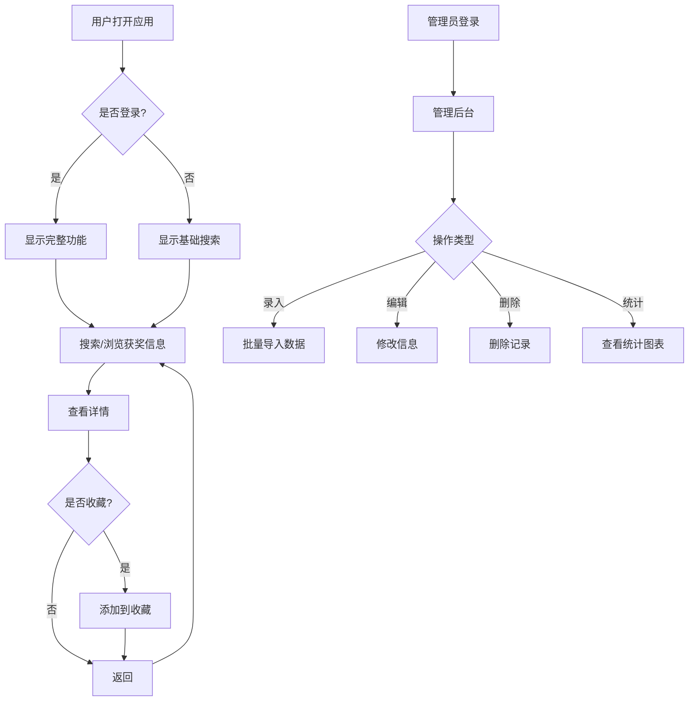

# 科研奖励获奖信息查询系统 - 桌面端版本 PRD

## 1. 产品概述
科研奖励获奖信息查询系统桌面端版本，提供与微信小程序相同的功能，方便在桌面环境下调试和使用。采用 Electron + React 技术栈，支持 Windows、macOS 和 Linux 平台。

## 2. 核心功能

### 2.1 用户角色
| 角色 | 登录方式 | 核心权限 |
|------|----------|----------|
| 普通用户 | 本地账户/游客模式 | 搜索、查看、收藏 |
| 管理员 | 管理员账户 | 搜索、编辑、添加、删除、导入数据 |

### 2.2 功能模块
1. **首页**: 搜索框、热门奖项、快捷入口、统计数据
2. **搜索结果页**: 搜索列表、筛选条件、模糊匹配
3. **详情页**: 获奖信息详情、收藏功能
4. **管理页**: 数据录入、编辑、删除、批量导入
5. **统计页**: 获奖统计、图表展示（饼图、柱状图、趋势图）
6. **登录页**: 用户登录
7. **收藏页**: 收藏列表管理

### 2.3 页面详情
| 页面名称 | 模块名称 | 功能描述 |
|----------|----------|----------|
| 首页 | 搜索模块 | 支持姓名、单位、成果名称、奖项名称模糊搜索 |
| 首页 | 快捷入口 | 热门奖项、最新获奖、统计入口 |
| 首页 | 统计卡片 | 总获奖数、获奖单位数、奖项种类数 |
| 搜索结果页 | 结果列表 | 展示匹配结果，支持分页 |
| 搜索结果页 | 筛选器 | 按奖项类型、年份、单位筛选 |
| 详情页 | 信息展示 | 完整获奖信息展示 |
| 详情页 | 收藏功能 | 用户可收藏感兴趣的获奖信息 |
| 管理页 | 数据录入 | 从Excel/TXT批量导入数据 |
| 管理页 | 编辑模块 | 修改、删除获奖信息 |
| 统计页 | 统计模块 | 按人、奖项、单位统计获奖数 |
| 统计页 | 图表模块 | 奖项随届数/时间变化图表 |
| 登录页 | 登录模块 | 本地账户登录 |

## 3. 核心流程

## 4. 用户界面设计

### 4.1 设计规范
- **主色调**: #10B981 (翡翠绿) - 代表学术、科技
- **辅助色**: #3B82F6 (蓝色) - 辅助强调
- **背景色**: #f5f5f5 (浅灰)
- **字体**: 系统默认字体，中文使用微软雅黑/苹方
- **按钮样式**: 圆角设计，阴影效果
- **布局**: 卡片式布局，左侧导航栏

### 4.2 布局结构
- **左侧导航栏**: 首页、搜索、统计、收藏、管理
- **主内容区**: 根据导航显示不同页面
- **顶部栏**: 标题、用户信息、搜索框

### 4.3 响应式设计
- 窗口最小尺寸: 1024x768
- 自适应布局，支持最大化/还原
- 触摸友好的按钮尺寸

## 5. 数据存储

### 5.1 本地存储
- 使用 SQLite 数据库存储获奖信息
- 使用 localStorage 存储用户设置和收藏
- 数据文件位置: 应用数据目录

### 5.2 数据加密
- 敏感数据使用 AES-256 加密
- 配置文件加密存储

## 6. 安全特性
- 查询频率限制: 每小时100次
- 管理员权限验证
- 数据导出加密
