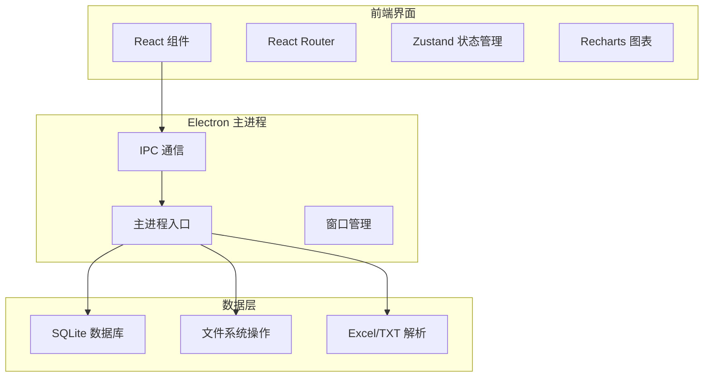
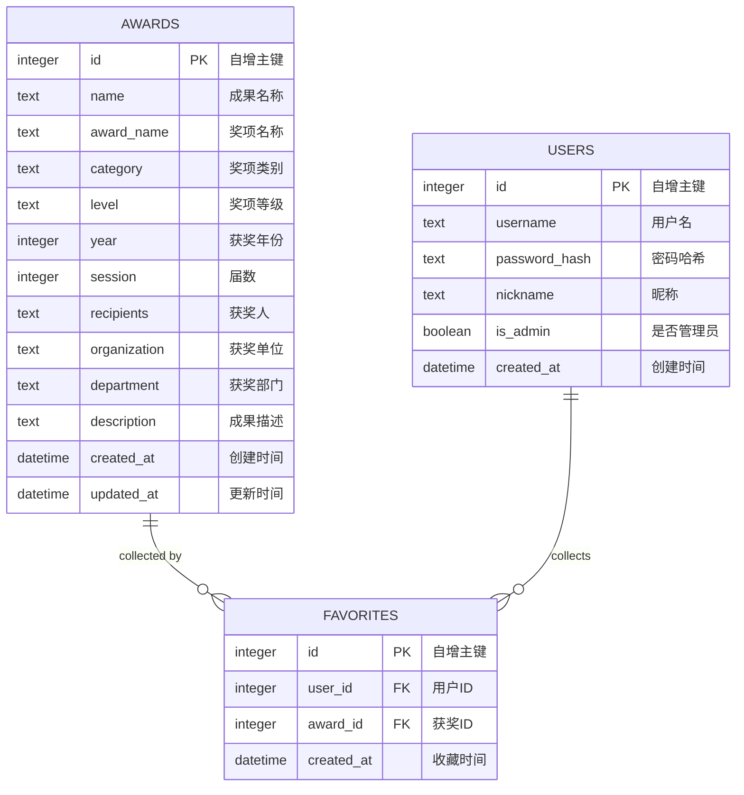

# 科研奖励获奖信息查询系统 - 桌面端技术架构

## 1. 架构设计



## 2. 技术栈

### 2.1 前端
- **框架**: React 18 + TypeScript
- **构建工具**: Vite
- **路由**: React Router v6
- **状态管理**: Zustand
- **UI 组件**: 自定义组件 + Tailwind CSS
- **图表**: Recharts
- **表格**: AG Grid 或 React Table

### 2.2 Electron
- **版本**: Electron 28
- **主进程**: Node.js + TypeScript
- **渲染进程**: React
- **IPC 通信**: Electron IPC
- **打包**: electron-builder

### 2.3 数据存储
- **数据库**: better-sqlite3
- **ORM**: 自定义轻量级 ORM
- **文件解析**: xlsx (Excel), fs (TXT)

## 3. 项目结构

```
/desktop-app
├── electron/                 # Electron 主进程
│   ├── main.ts              # 主进程入口
│   ├── preload.ts           # 预加载脚本
│   └── ipc/                 # IPC 处理
│       ├── database.ts      # 数据库操作
│       └── file.ts          # 文件操作
├── src/                     # React 前端
│   ├── components/          # 通用组件
│   ├── pages/               # 页面组件
│   ├── stores/              # Zustand 状态
│   ├── hooks/               # 自定义 Hooks
│   ├── utils/               # 工具函数
│   └── types/               # TypeScript 类型
├── database/                # 数据库相关
│   ├── schema.sql           # 数据库结构
│   └── migrations/          # 迁移文件
├── resources/               # 静态资源
├── dist/                    # 构建输出
├── package.json
├── vite.config.ts
├── electron.vite.config.ts
└── tsconfig.json
```

## 4. 数据库设计

### 4.1 数据模型



### 4.2 SQL 结构

```sql
-- 奖项表
CREATE TABLE awards (
    id INTEGER PRIMARY KEY AUTOINCREMENT,
    name TEXT NOT NULL,
    award_name TEXT NOT NULL,
    category TEXT,
    level TEXT CHECK(level IN ('国家级', '省级', '市级', '校级')),
    year INTEGER,
    session INTEGER,
    recipients TEXT,
    organization TEXT,
    department TEXT,
    description TEXT,
    created_at DATETIME DEFAULT CURRENT_TIMESTAMP,
    updated_at DATETIME DEFAULT CURRENT_TIMESTAMP
);

-- 用户表
CREATE TABLE users (
    id INTEGER PRIMARY KEY AUTOINCREMENT,
    username TEXT UNIQUE NOT NULL,
    password_hash TEXT NOT NULL,
    nickname TEXT,
    is_admin BOOLEAN DEFAULT FALSE,
    created_at DATETIME DEFAULT CURRENT_TIMESTAMP
);

-- 收藏表
CREATE TABLE favorites (
    id INTEGER PRIMARY KEY AUTOINCREMENT,
    user_id INTEGER REFERENCES users(id),
    award_id INTEGER REFERENCES awards(id),
    created_at DATETIME DEFAULT CURRENT_TIMESTAMP,
    UNIQUE(user_id, award_id)
);

-- 索引
CREATE INDEX idx_awards_name ON awards(name);
CREATE INDEX idx_awards_award_name ON awards(award_name);
CREATE INDEX idx_awards_recipients ON awards(recipients);
CREATE INDEX idx_awards_organization ON awards(organization);
CREATE INDEX idx_awards_year ON awards(year);
```

## 5. IPC 接口定义

### 5.1 数据库操作
```typescript
// 查询奖项
ipcRenderer.invoke('db:query', sql: string, params?: any[]): Promise<any[]>

// 执行SQL
ipcRenderer.invoke('db:exec', sql: string): Promise<void>

// 插入数据
ipcRenderer.invoke('db:insert', table: string, data: object): Promise<number>

// 更新数据
ipcRenderer.invoke('db:update', table: string, id: number, data: object): Promise<void>

// 删除数据
ipcRenderer.invoke('db:delete', table: string, id: number): Promise<void>
```

### 5.2 文件操作
```typescript
// 导入Excel
ipcRenderer.invoke('file:importExcel', filePath: string): Promise<Award[]>

// 导入TXT
ipcRenderer.invoke('file:importTxt', filePath: string): Promise<Award[]>

// 导出数据
ipcRenderer.invoke('file:export', data: Award[], format: 'excel' | 'json'): Promise<string>
```

## 6. 构建配置

### 6.1 开发环境
```bash
npm run dev          # 启动开发服务器
npm run electron:dev # 启动 Electron 开发模式
```

### 6.2 生产构建
```bash
npm run build        # 构建前端
npm run electron:build # 构建 Electron 应用
npm run dist         # 打包分发版本
```

### 6.3 目标平台
- Windows (exe, msi)
- macOS (dmg, zip)
- Linux (AppImage, deb, rpm)
