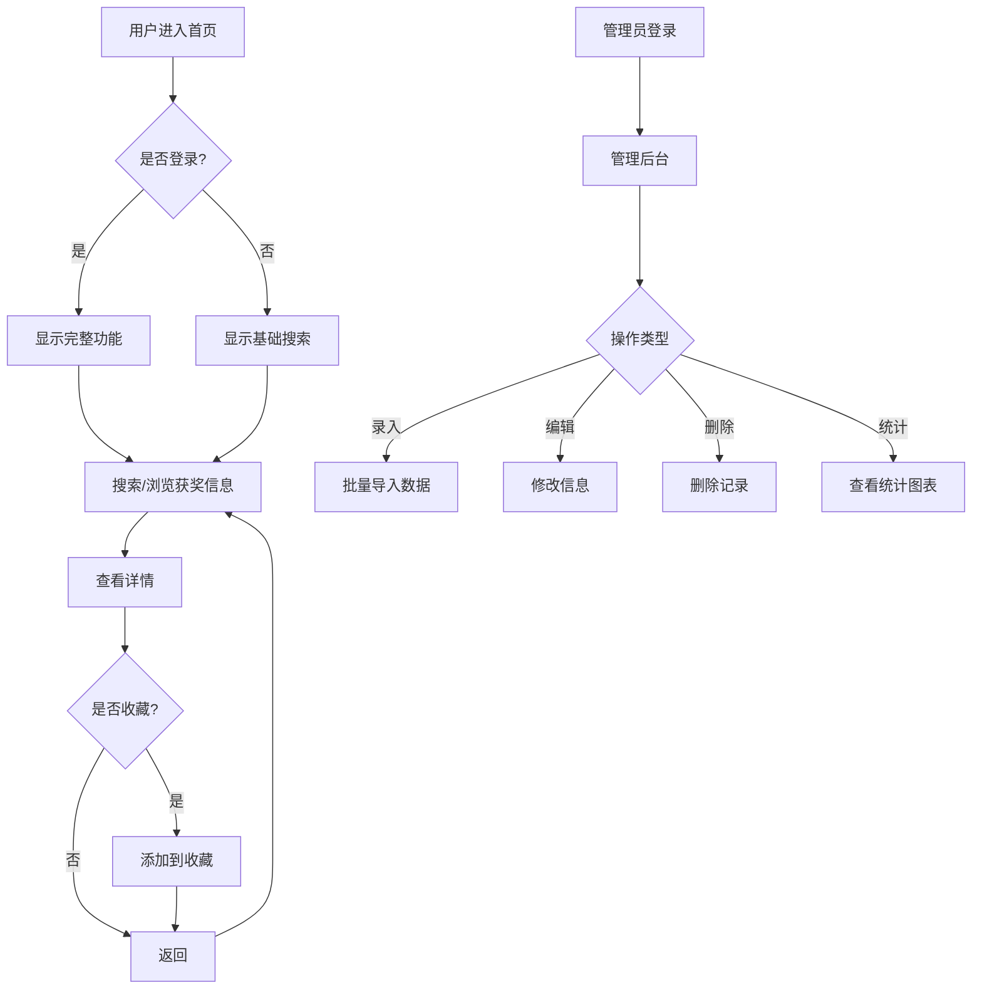

## 1. Product Overview
科研奖励获奖信息查询系统是一款微信小程序，提供获奖名单的搜索、管理、统计和可视化功能。用户可以查询获奖信息，管理员可以进行数据录入和编辑，系统还提供统计分析和图表展示功能。

## 2. Core Features

### 2.1 User Roles
| Role | Registration Method | Core Permissions |
|------|---------------------|------------------|
| Normal User | WeChat login | Search awards, view details, collect favorites |
| Admin | Admin account | Search, edit, add, delete awards, import data |

### 2.2 Feature Module
1. **首页**: 搜索框、热门奖项、快捷入口
2. **搜索结果页**: 搜索列表、筛选条件、模糊匹配
3. **详情页**: 获奖信息详情、收藏功能
4. **管理页**: 数据录入、编辑、删除
5. **统计页**: 获奖统计、图表展示
6. **登录页**: 用户登录、注册

### 2.3 Page Details
| Page Name | Module Name | Feature description |
|-----------|-------------|---------------------|
| 首页 | 搜索模块 | 支持姓名、单位、成果名称、奖项名称模糊搜索 |
| 首页 | 快捷入口 | 热门奖项、最新获奖、统计入口 |
| 搜索结果页 | 结果列表 | 展示匹配结果，支持分页 |
| 搜索结果页 | 筛选器 | 按奖项类型、年份、单位筛选 |
| 详情页 | 信息展示 | 完整获奖信息展示 |
| 详情页 | 收藏功能 | 用户可收藏感兴趣的获奖信息 |
| 管理页 | 数据录入 | 从Excel/TXT批量导入数据 |
| 管理页 | 编辑模块 | 修改、删除获奖信息 |
| 统计页 | 统计模块 | 按人、奖项、单位统计获奖数 |
| 统计页 | 图表模块 | 奖项随届数/时间变化图表 |
| 登录页 | 登录模块 | 微信授权登录 |

## 3. Core Process

## 4. User Interface Design
### 4.1 Design Style
- Primary color: #10B981 (Emerald green) - 代表学术、科技
- Secondary color: #3B82F6 (Blue) - 辅助强调
- Button style: Rounded corners, shadow effects
- Font: PingFang SC, sans-serif
- Layout style: Card-based, clean and professional
- Icon style: Minimalist, line icons

### 4.2 Page Design Overview
| Page Name | Module Name | UI Elements |
|-----------|-------------|-------------|
| 首页 | 搜索框 | Large input field, search button, filter tags |
| 首页 | 快捷入口 | Grid layout, icon + text cards |
| 搜索结果页 | 列表 | Card with title, subtitle, brief info |
| 详情页 | 信息卡片 | Scrollable content, action buttons |
| 管理页 | 操作区 | Import button, add button, search filter |
| 统计页 | 图表 | Bar chart, line chart, pie chart |

### 4.3 Responsiveness
- Mobile-first design
- Touch-friendly buttons (minimum 44px)
- Adaptive layouts for different screen sizes

### 4.4 Security Requirements
- Data encryption for local storage
- Query limit per user per session
- Anti-crawler measures
