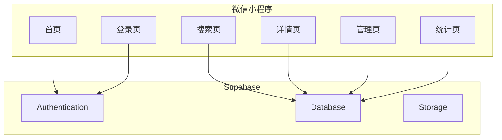
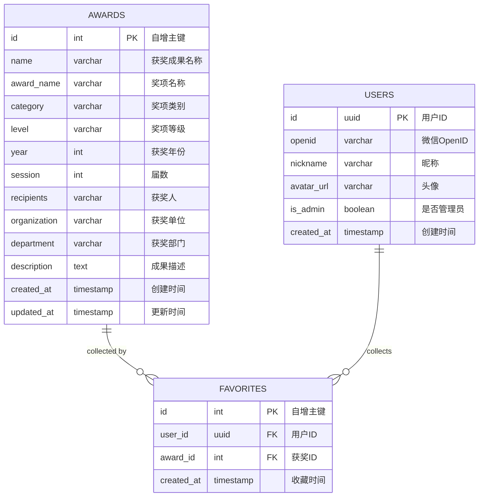

## 1. Architecture Design



## 2. Technology Description
- Frontend: 微信小程序原生开发 + TypeScript
- Backend: Supabase (PostgreSQL)
- Initialization Tool: 微信开发者工具
- Chart Library: ECharts for WeChat
- State Management: App全局状态

## 3. Route Definitions
| Route | Purpose |
|-------|---------|
| /pages/index | 首页，搜索入口 |
| /pages/search | 搜索结果页 |
| /pages/detail | 获奖详情页 |
| /pages/admin | 管理后台 |
| /pages/statistics | 统计分析页 |
| /pages/login | 登录页 |
| /pages/favorites | 收藏列表页 |

## 4. API Definitions

### 4.1 搜索接口
- **GET /api/awards/search**
  - 参数: `keyword`, `page`, `size`, `filter`
  - 返回: Award[]

### 4.2 详情接口
- **GET /api/awards/:id**
  - 返回: Award

### 4.3 统计接口
- **GET /api/statistics/person/:name**
  - 返回: { count: number, awards: Award[] }
- **GET /api/statistics/award/:name**
  - 返回: { count: number, trend: Trend[] }
- **GET /api/statistics/organization/:name**
  - 返回: { count: number, awards: Award[] }

### 4.4 收藏接口
- **POST /api/favorites**
  - 参数: { awardId }
- **GET /api/favorites**
  - 返回: Favorite[]
- **DELETE /api/favorites/:id**

### 4.5 管理接口
- **POST /api/awards**
  - 参数: Award
- **PUT /api/awards/:id**
  - 参数: Award
- **DELETE /api/awards/:id**
- **POST /api/awards/batch**
  - 参数: Award[]

## 5. Data Model

### 5.1 Data Model Definition



### 5.2 Data Definition Language

```sql
-- Awards table
CREATE TABLE awards (
    id SERIAL PRIMARY KEY,
    name VARCHAR(255) NOT NULL,
    award_name VARCHAR(255) NOT NULL,
    category VARCHAR(100),
    level VARCHAR(50),
    year INTEGER,
    session INTEGER,
    recipients VARCHAR(500),
    organization VARCHAR(255),
    department VARCHAR(255),
    description TEXT,
    created_at TIMESTAMP DEFAULT CURRENT_TIMESTAMP,
    updated_at TIMESTAMP DEFAULT CURRENT_TIMESTAMP
);

-- Users table
CREATE TABLE users (
    id UUID PRIMARY KEY DEFAULT uuid_generate_v4(),
    openid VARCHAR(100) UNIQUE NOT NULL,
    nickname VARCHAR(100),
    avatar_url VARCHAR(500),
    is_admin BOOLEAN DEFAULT FALSE,
    created_at TIMESTAMP DEFAULT CURRENT_TIMESTAMP
);

-- Favorites table
CREATE TABLE favorites (
    id SERIAL PRIMARY KEY,
    user_id UUID REFERENCES users(id),
    award_id INTEGER REFERENCES awards(id),
    created_at TIMESTAMP DEFAULT CURRENT_TIMESTAMP,
    UNIQUE(user_id, award_id)
);

-- Indexes
CREATE INDEX idx_awards_name ON awards(name);
CREATE INDEX idx_awards_award_name ON awards(award_name);
CREATE INDEX idx_awards_recipients ON awards(recipients);
CREATE INDEX idx_awards_organization ON awards(organization);
CREATE INDEX idx_awards_year ON awards(year);
```

## 6. Security Considerations
### 6.1 Query Limits
- Single user query limit: 100 queries per hour
- Rate limiting implemented at API level

### 6.2 Data Encryption
- Local storage data encrypted using AES-256
- Sensitive data stored with encryption

### 6.3 Access Control
- Admin routes protected
- CRUD operations require authentication
- Row-level security for user-specific data
